# Simple Student Manager
Simple student manager written in [Rust](https://www.rust-lang.org/)

## Build and run instruction
Go to [Rust website](https://www.rust-lang.org/) and install the rust compiler/rust package manager.
Naviage to the project folder using a terminal.
```bash
cargo run -- --version # to see build date and version
cargo run              # to start program
```

## Demo

### Exercise 01

#### Add
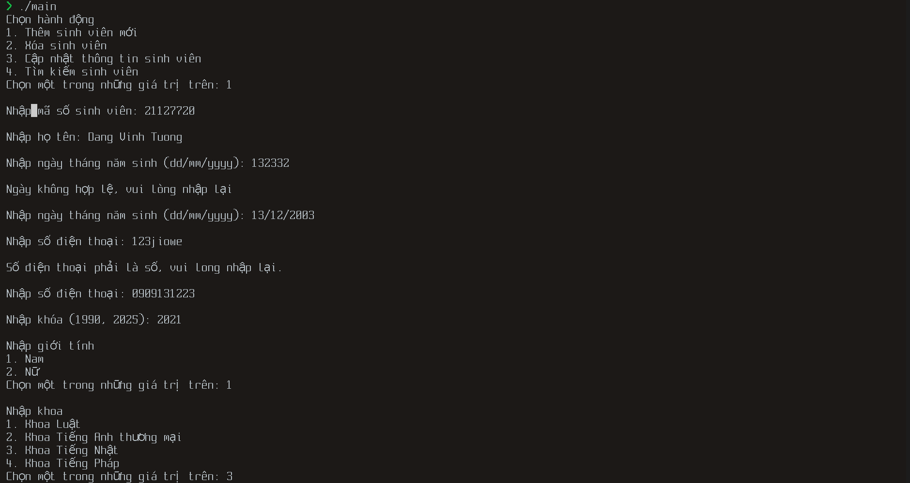
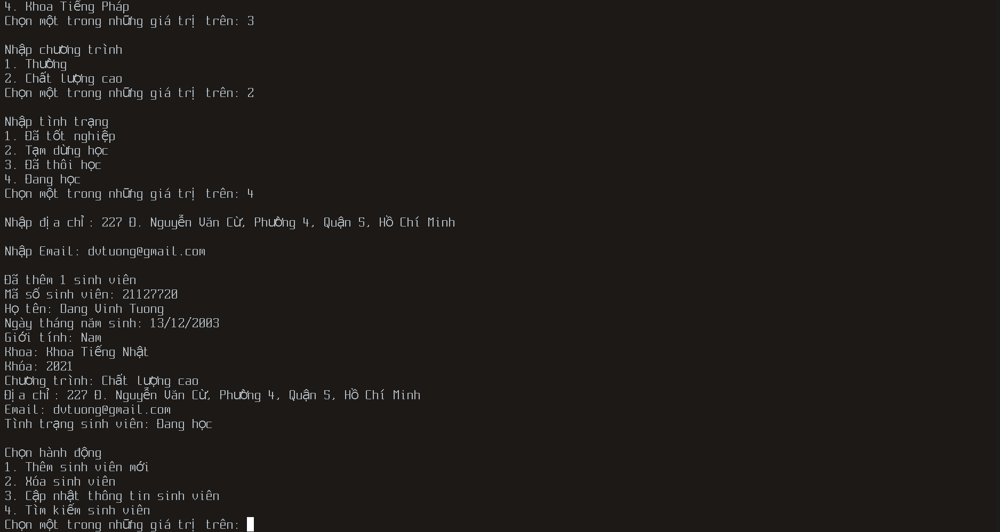

#### Search
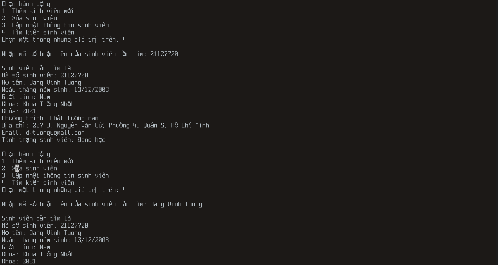

#### Update
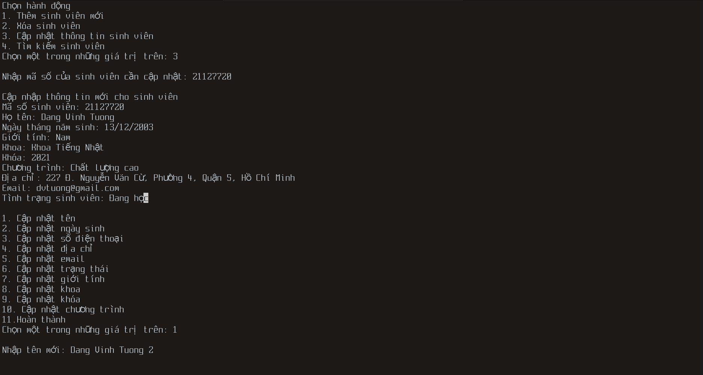
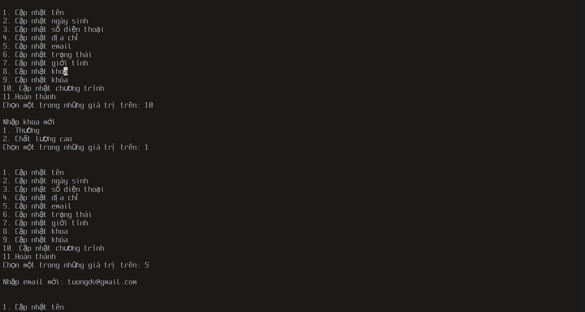
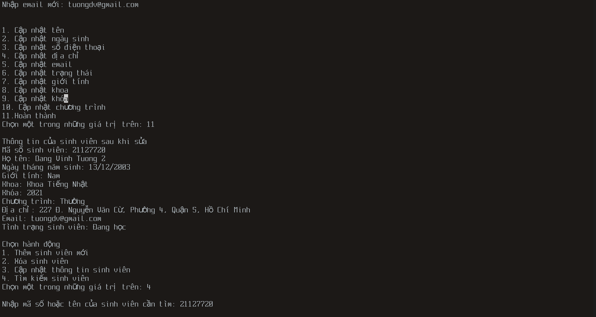
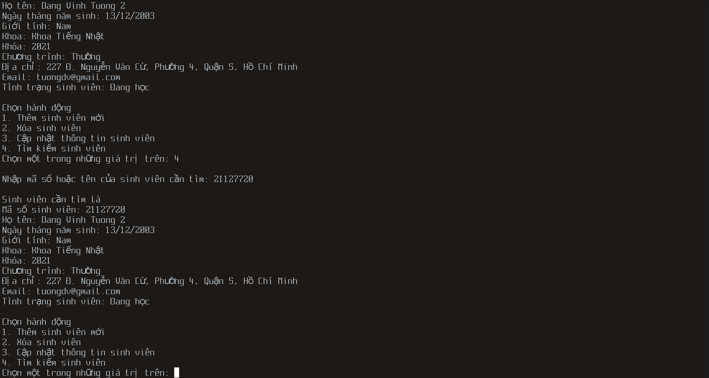

#### Delete
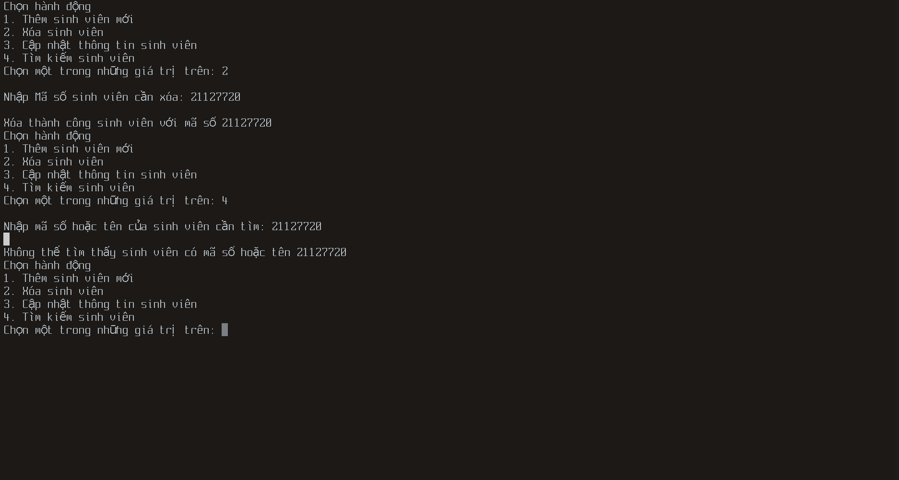

### Exercise 02

#### Menu
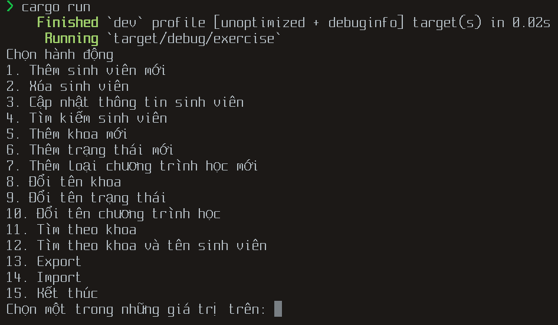

#### New Faculty
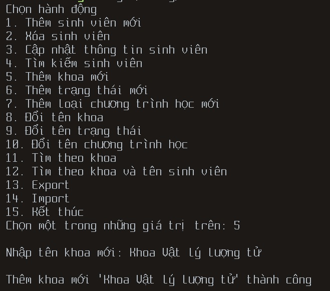

#### Search by Faculty
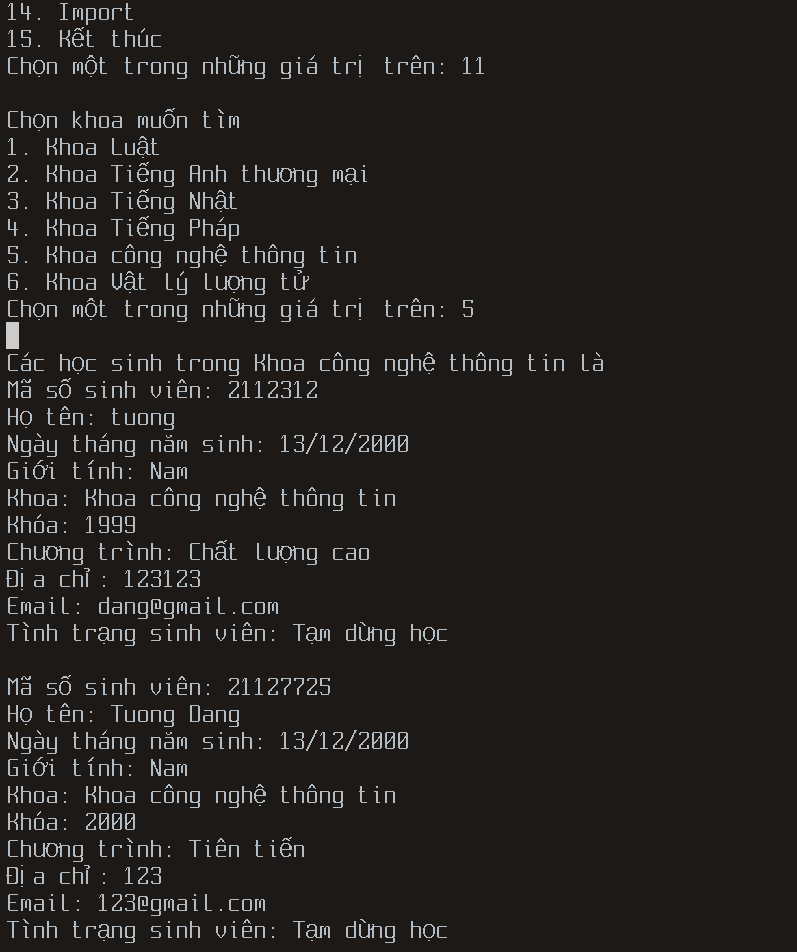

#### Export
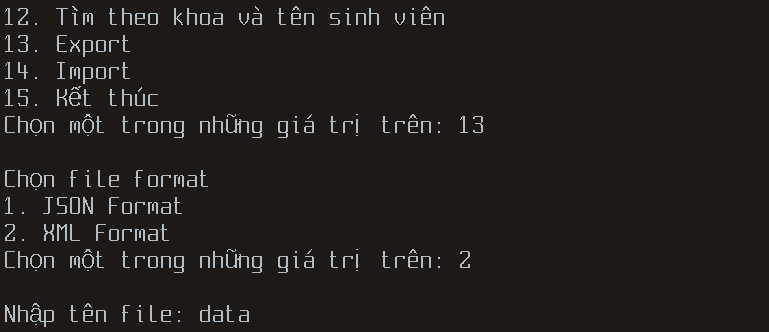

#### Import
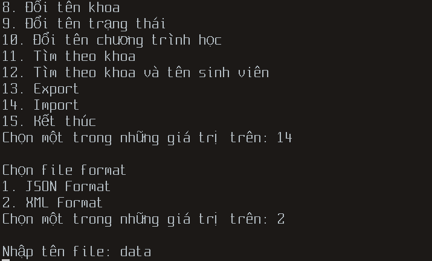

#### Loggin
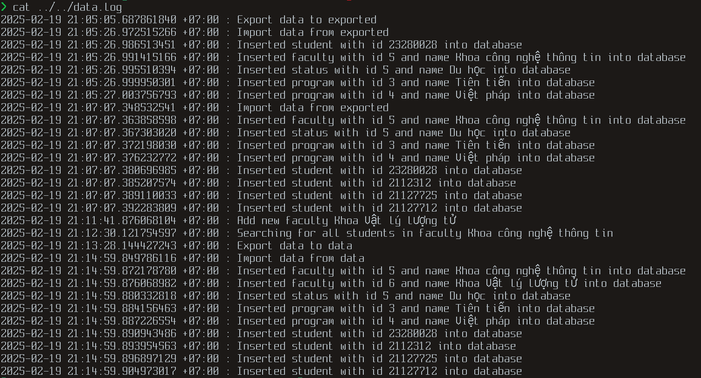
